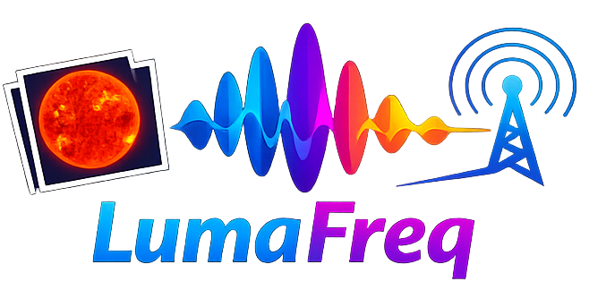

  

<h1 align="center">WavePix</h1>

<strong>Turn any image into radio waves — SSTV modulation in pure Python</strong>

  

---

WavePix generates SSTV-modulated WAV files from any image that PIL can open
(PNG, JPEG, GIF, and many others). These WAV files can be played by any
audio player connected to a shortwave radio for transmission.

The codebase is designed for readability over raw performance — only
optimizations that didn't complicate the code have been applied.

## Command line usage

### Basic usage

Convert an image to a WAV file using the default mode (MartinM1):

    $ python -m pysstv input.jpg output.wav

Use `--resize` to automatically resize the image to the mode's required dimensions:

    $ python -m pysstv input.jpg output.wav --resize

### Choosing a mode

Specify a mode with `--mode`:

    $ python -m pysstv input.jpg output.wav --mode MartinM1 --resize
    $ python -m pysstv input.jpg output.wav --mode ScottieS1 --resize
    $ python -m pysstv input.jpg output.wav --mode Robot36 --resize

### Available modes

**Color modes** (RGB encoding): MartinM1, MartinM2, ScottieS1, ScottieS2,
ScottieDX, PasokonP3, PasokonP5, PasokonP7, PD90, PD120, PD160, PD180,
PD240, PD290, WraaseSC2120, WraaseSC2180

**Color modes** (YCrCb encoding): Robot36, Robot72

**Grayscale modes**: Robot8BW, Robot24BW

> **Tip:** MartinM1 and ScottieS1 are the most widely supported color modes
> across SSTV decoder apps. Robot36 uses YCrCb encoding, which some decoders
> may display as monochrome if they don't reconstruct the chrominance channels
> correctly.

### Full option reference

    $ python -m pysstv -h
    usage: __main__.py [-h]
                  [--mode {MartinM1,MartinM2,ScottieS1,ScottieS2,ScottieDX,Robot36,PasokonP3,PasokonP5,PasokonP7,PD90,PD120,PD160,PD180,PD240,PD290,WraaseSC2120,WraaseSC2180,Robot8BW,Robot24BW}]
                  [--rate RATE] [--bits BITS] [--vox] [--fskid FSKID]
                  [--chan CHAN] [--resize] [--keep-aspect-ratio]
                  [--keep-aspect] [--resample {nearest,bicubic,lanczos}]
                  image.png output.wav

    Converts an image to an SSTV modulated WAV file.

    positional arguments:
      image.png             input image file name
      output.wav            output WAV file name

    options:
      -h, --help            show this help message and exit
      --mode {MartinM1,...}  image mode (default: Martin M1)
      --rate RATE           sampling rate (default: 48000)
      --bits BITS           bits per sample (default: 16)
      --vox                 add VOX tones at the beginning
      --fskid FSKID         add FSKID at the end
      --chan CHAN           number of channels (default: mono)
      --resize              resize the image to the correct size
      --keep-aspect-ratio   keep the original aspect ratio when resizing
                                (and cut off excess pixels)
      --keep-aspect         keep the original aspect ratio when resizing
                                (not cut off excess pixels)
      --resample {nearest,bicubic,lanczos}
                            which resampling filter to use for resizing
                                (see Pillow documentation)

## Python interface

The `SSTV` class in the `sstv` module implements basic SSTV-related
functionality, and the classes of other modules such as `grayscale` and
`color` extend this. Most instances implement the following methods:

- `__init__` takes a PIL image, the samples per second, and the bits per
  sample as a parameter, but doesn't perform any hard calculations
- `gen_freq_bits` generates tuples that describe a sine wave segment with
  frequency in Hz and duration in ms
- `gen_values` generates samples between -1 and +1, performing sampling
  according to the samples per second value given during construction
- `gen_samples` generates discrete samples, performing quantization
  according to the bits per sample value given during construction
- `write_wav` writes the whole image to a Microsoft WAV file

The above methods all build upon those above them, for example `write_wav`
calls `gen_samples`, while latter calls `gen_values`, so typically, only
the first and the last, maybe the last two should be called directly, the
others are just listed here for the sake of completeness and to make the
flow easier to understand.

## HTTP Server

A production-ready REST API is included in the `server/` directory for converting images to SSTV WAV files over HTTP.

### Quick start (development)

    $ pip install -r server/requirements.txt
    $ flask --app server.wsgi run --debug

### Quick start (production with Gunicorn)

    $ pip install -r server/requirements.txt
    $ gunicorn server.wsgi:app --bind 0.0.0.0:8000 --workers 4 --timeout 120

### Docker (backend only)

    $ docker build -t pysstv-server .
    $ docker run -p 8000:8000 pysstv-server

### Docker Compose (full stack)

Bring up both the backend and frontend with a single command:

    $ docker compose up --build

Open http://localhost:3000. Nginx serves the React app and proxies `/api/` to the backend.

For **live-reload during development**, use watch mode — Docker will automatically sync file changes to the backend container and rebuild the frontend when source files change:

    $ docker compose watch

To change the published port:

    $ PORT=8080 docker compose up --build

Stop everything:

    $ docker compose down

Teardown completely (remove containers, images, and volumes):

    $ docker compose down --rmi all --volumes --remove-orphans

### API Endpoints

**`GET /health`** — Health check.

    $ curl http://localhost:8000/health
    {"status": "ok"}

**`GET /modes`** — List available SSTV modes.

    $ curl http://localhost:8000/modes

**`POST /convert`** — Convert an image to a WAV file.

Form parameters:

- `image` (required) — the image file
- `mode` — SSTV mode (default: `MartinM1`)
- `sample_rate` — sampling rate in Hz (default: `48000`)
- `bits` — bits per sample, `8` or `16` (default: `16`)
- `resize` — resize image to fit mode, `true`/`false` (default: `true`)
- `vox` — add VOX tones, `true`/`false` (default: `false`)
- `fskid` — FSK ID string (optional)

Example:

    $ curl -X POST http://localhost:8000/convert \
        -F "image=@photo.jpg" \
        -F "mode=ScottieS1" \
        --output photo_ScottieS1.wav

### Environment variables

| Variable             | Default | Description                    |
| -------------------- | ------- | ------------------------------ |
| `MAX_UPLOAD_SIZE_MB` | `10`    | Maximum upload file size in MB |
| `LOG_LEVEL`          | `INFO`  | Logging level                  |

## Web Frontend

A React-based single-page app lives in `frontend/`. It provides a visual interface for batch-converting images and playing the resulting SSTV audio directly in the browser.

### Features

- **Drag-and-drop** (or click-to-browse) multi-image upload with thumbnail previews, per-image remove, and a max of 10 images
- **Mode picker** — populated from the server's `/modes` endpoint
- **Mode legend** — inline info hint showing the recommended upload resolution for the selected mode; expands to a full reference table of all 19 modes
- **Demo samples** — five pre-converted image/audio pairs so users can preview SSTV output instantly without hitting the server
- **How-to-use guide** — dedicated page with step-by-step instructions for decoding SSTV audio with Robot36 and other apps, accessible via a visible link in the header
- **Batch conversion queue** — jobs are processed sequentially; status badges show pending / converting / transmit / error
- **Built-in audio player** — play, pause, stop, seek, and "next" controls; only one track plays at a time
- **Animated radio waves** — SVG broadcast animation in the header pulses when audio is transmitting
- **Thumbnails and download** — each job shows a preview of the source image with a one-click WAV download
- **Dark mode** — automatic via `prefers-color-scheme`
- **Responsive** — optimized for both desktop and mobile

### Quick start

Make sure the API server is running on port 8000 (see [HTTP Server](#http-server) above), then:

    $ cd frontend
    $ npm install
    $ npm run dev

Open http://localhost:5173. The Vite dev server proxies `/api` requests to the Flask backend automatically.

### Production build

    $ cd frontend
    $ npm run build

The output in `frontend/dist/` can be served by any static file server (Nginx, Caddy, etc.). Point the `/api` route to the backend with a reverse proxy.

### Recommended upload resolutions

For a 1:1 pixel mapping (no scaling artifacts), upload images at the native size of the chosen mode:

| Mode                                                             | Resolution |
| ---------------------------------------------------------------- | ---------- |
| MartinM1, ScottieS1, ScottieDX, PD90, WraaseSC2120, WraaseSC2180 | 320 × 256  |
| MartinM2, ScottieS2                                              | 160 × 256  |
| Robot36, Robot24BW                                               | 320 × 240  |
| Robot8BW                                                         | 160 × 120  |
| PasokonP3, PasokonP5, PasokonP7, PD120, PD180, PD240             | 640 × 496  |
| PD160                                                            | 512 × 400  |
| PD290                                                            | 800 × 616  |

> **Note:** If `resize` is enabled (the default), images are automatically scaled to fit. The table above is for users who want pixel-perfect output.

### Project structure

    frontend/
    ├── public/
    │   ├── demo_audio/     # Pre-converted MP3 demo samples
    │   ├── demo_thumbs/    # Optimized WebP thumbnails for demos
    │   └── test_images/    # Original test PNG images
    ├── src/
    │   ├── api/           # API client (fetchModes, convertImage)
    │   ├── components/
    │   │   ├── AudioPlayer/   # Play/pause/stop/seek controls
    │   │   ├── BatchList/     # Conversion job list with status & actions
    │   │   ├── DemoSection/   # Pre-converted sample image/audio pairs
    │   │   ├── HowToUse/      # Step-by-step SSTV decoder guide
    │   │   ├── ModeLegend/    # Collapsible mode resolution reference
    │   │   ├── RadioWaves/    # Animated SVG broadcast indicator
    │   │   └── UploadForm/    # Drag-and-drop image upload + mode picker
    │   ├── hooks/
    │   │   ├── useAudioPlayer.ts    # Manages a single HTMLAudioElement
    │   │   └── useConversionQueue.ts # Batch queue with sequential processing
    │   ├── types/         # Shared TypeScript interfaces
    │   ├── App.tsx        # Root layout wiring hooks → components
    │   └── index.css      # Global CSS custom properties & reset
    └── vite.config.ts     # Dev server proxy (/api → localhost:8000)

## License

The whole project is available under MIT license.

## Useful links

- receive-only "counterpart": https://github.com/windytan/slowrx
- free SSTV handbook: http://www.sstv-handbook.com/
- robot 36 encoder/decoder in C: https://github.com/xdsopl/robot36/

## Dependencies

- Python 3.5 or later
- Python Imaging Library (Debian/Ubuntu package: `python3-pil`)
- Flask, Gunicorn, Pillow (server — see `server/requirements.txt`)
- Node.js 18+ and npm (frontend — see `frontend/package.json`)
